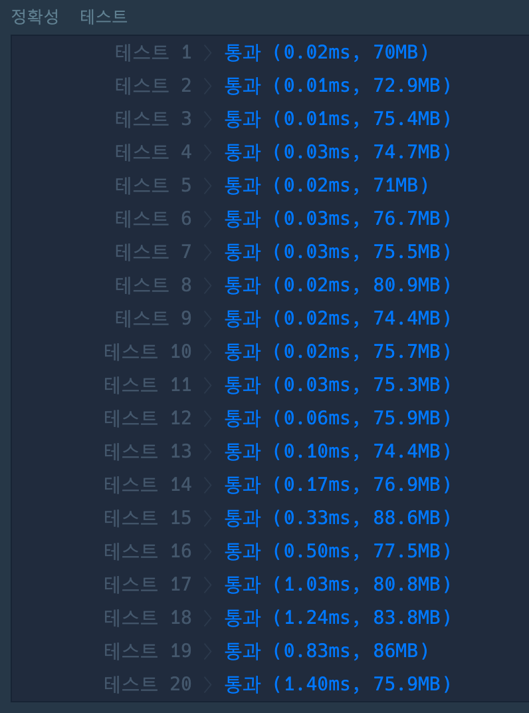

# 풀이
요소가 가로, 세로 밖에 없으므로 둘 중 작은 것들만 모아서 최대값을 찾고, 큰 것들만 모아서 최댓값을 찾은 다음 둘을 곱하면 됩니다. 저는 swap 해서 한 쪽으로 작은 값을 모았습니다.

다 풀고 다른 답을 봤는데 Math.max 함수나 for-each 문을 이용하는 경우가 많았습니다. 효율성 면에서는 잘 모르겠지만 깔끔하더라고요. 다음엔 어떻게 할 지는 고민을 해봐야...,,

## 결과

---
# 문제
[링크](https://school.programmers.co.kr/learn/courses/30/lessons/86491)

명함 지갑을 만드는 회사에서 지갑의 크기를 정하려고 합니다. 다양한 모양과 크기의 명함들을 모두 수납할 수 있으면서, 작아서 들고 다니기 편한 지갑을 만들어야 합니다. 이러한 요건을 만족하는 지갑을 만들기 위해 디자인팀은 모든 명함의 가로 길이와 세로 길이를 조사했습니다.

아래 표는 4가지 명함의 가로 길이와 세로 길이를 나타냅니다.

|명함번호|가로 길이|세로 길이|
|:---:|:---:|:---:|
|1|60|50|
|2|30|70|
|3|60|30|
|4|80|40|

가장 긴 가로 길이와 세로 길이가 각각 80, 70이기 때문에 80(가로) x 70(세로) 크기의 지갑을 만들면 모든 명함들을 수납할 수 있습니다. 하지만 2번 명함을 가로로 눕혀 수납한다면 80(가로) x 50(세로) 크기의 지갑으로 모든 명함들을 수납할 수 있습니다. 이때의 지갑 크기는 4000(=80 x 50)입니다.

모든 명함의 가로 길이와 세로 길이를 나타내는 2차원 배열 sizes가 매개변수로 주어집니다. 모든 명함을 수납할 수 있는 가장 작은 지갑을 만들 때, 지갑의 크기를 return 하도록 solution 함수를 완성해주세요.

제한사항

sizes의 길이는 1 이상 10,000 이하입니다.
sizes의 원소는 [w, h] 형식입니다.
w는 명함의 가로 길이를 나타냅니다.
h는 명함의 세로 길이를 나타냅니다.
w와 h는 1 이상 1,000 이하인 자연수입니다.
